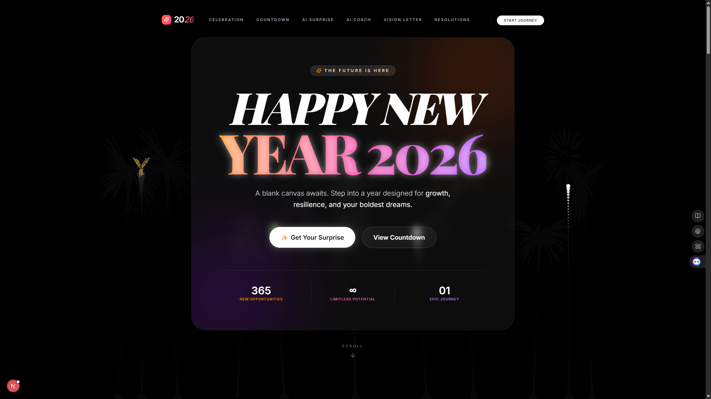

# Happy New Year 2026 🎉

<p align="center">
  
</p>

<p align="center"><em>Interactive AI Vision Letter Generator for 2026</em></p>

**Repository Description:**  
An interactive web application to celebrate the arrival of 2026! Users can generate **AI-written vision letters** from their future self, share resolutions, and enjoy New Year countdowns and celebration effects. Built with Next.js, React, and Tailwind CSS, this app combines fun, motivation, and interactive features for a memorable New Year experience.  

> **Note:** The vision letters are generated using a **custom AI API route**, which leverages an **LLM (Large Language Model)** to create personalized letters based on user input.  

---

## Features

- **Future Vision Generator**: Generate a personalized letter from your future self for 2026 using AI.  
- **Share Your Resolution**: Submit and share your 2026 resolutions with the community.  
- **Countdown Section**: Live countdown timer to New Year.  
- **Celebration Effects**: Fireworks, animations, and other festive UI elements.  
- **Downloadable Vision Letter**: Save your AI-generated vision letter as a PDF.  
- **Secure Environment**: Sensitive `.env` files are properly ignored.  

---

## Tech Stack

- **Frontend**: Next.js 13 (App Router) + React  
- **Styling**: Tailwind CSS  
- **PDF Generation**: jsPDF  
- **AI Features**: Custom API routes leveraging an **LLM** to generate vision letters  
- **Version Control**: Git + GitHub  

---

## Installation

1. Clone the repository:

```bash
git clone https://github.com/DuoDduo/new_year.git
cd new_year
````

2. Install dependencies:

```bash
npm install
# or
pnpm install
# or
yarn
```

3. Copy environment variables:

```bash
copy .env.example .env.local
```

4. Start the development server:

```bash
npm run dev
```

Visit `http://localhost:3000` in your browser.

---

## Usage

1. Enter your name and your goals for 2026 in the **Future Vision Generator**.
2. Click **Generate My Future Letter** to see your AI-written vision letter.
3. Download the letter as a **PDF** for keepsake.
4. Share your resolutions in the **Share Your Resolution** section.

> All letters are **generated instantly by an AI-powered LLM**, no email is required for generation.

---

## AI Letter Generation Flow

```text
User Input (Name + Goals)
           │
           ▼
Custom API Route
           │
           ▼
LLM (Large Language Model)
           │
           ▼
AI-generated Vision Letter
           │
           ▼
Display on UI & Download as PDF
```

---

## Security Notes

* `.env` files are ignored in Git to keep API keys and sensitive data safe.
* Git history was cleaned to remove any previously committed secrets.

---

## License

This project is **MIT licensed**.

---

🎊 Wishing everyone a Happy New Year 2026! 🎊

